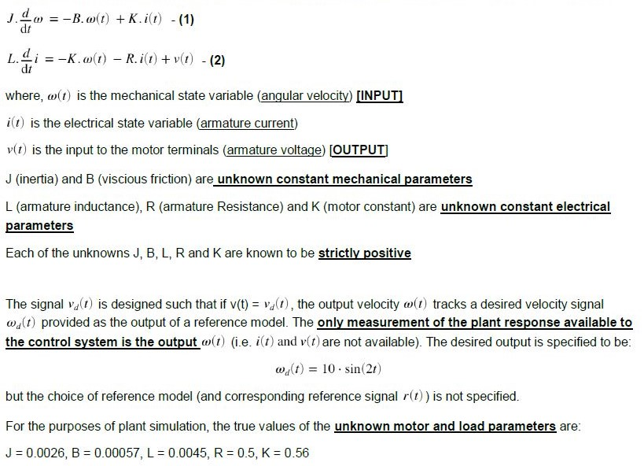
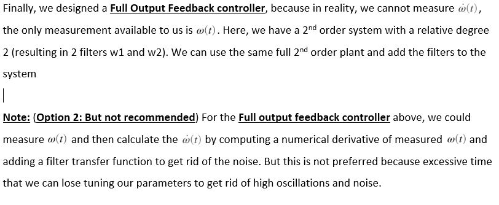

# 
Adaptive-Controls-Project-Part-1

**
 To design a [model reference adaptive controller](http://www.phoneoximeter.org/uploads/media/EECE574-11_MRAC_01.pdf) for a DC motor drive, which accounts for the presence of an unknown deadzone in the power electronincs, so that the approximate velocity tracking may be achieved without knowledge of motor, load or deadzone parameters.
**

> **Note: Part 2 of the Project deals with Model Reference Adaptive Control of Full Output Feedback DC motor drive system**

### Background:

 

 #### Dynamics of the **brush-commutated permanent-magent DC motor** turning an inertial load are described by:

 

### Overview (For Part 2):

 

### Results: 
## 
Full Output Feedback System

 

#### Languages Used:
- Matlab
- Simulink

#### Use of each file:
- [**AdaptiveControlsProjectPart2_Sethi.mlx**](AdaptiveControlsProjectPart1_Sethi.mlx) - Executable file with clearly defined problem statement and approach
- [**AdaptiveControlsProjectPart2_Sethi.pdf**](AdaptiveControlsProjectPart1_Sethi.pdf) - Published Document for a quick check of Solutions and Code
- [**AdaptiveControlsProjectPart2_Sethi.slx**](AdaptiveControlsProjectPart1_Sethi.slx) - Simulink Model with clearly defined subsystems of both reduced Order and Full Second Order system
> **Note:** Comment out the portion you are not going to use in both simulink and the .mlx script file.
